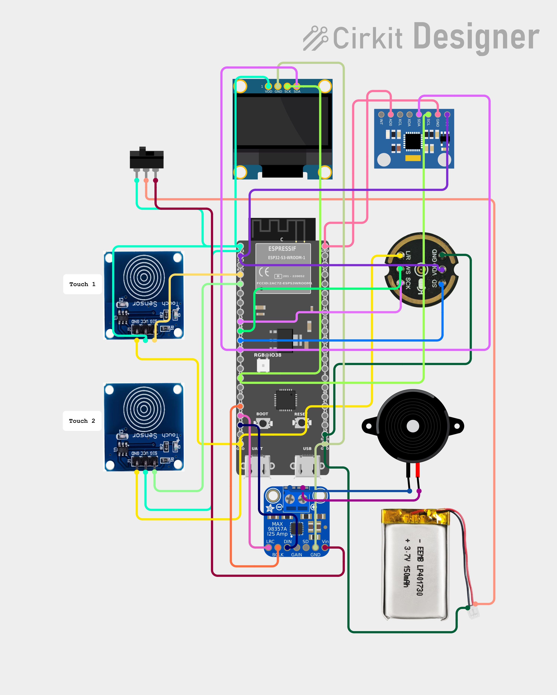

# Circuit Diagram for Prayer‑Bot

[📄 **README**](README.md) | [🔧 **Hardware Connections**](HARDWARE_CONNECTIONS.md) | [📐 **Circuit Diagram**](CIRCUIT.md) | [📜 **License**](LICENSE)

Below is the schematic of the hardware connections used in the project.

For an interactive view and to edit the circuit, visit the online designer:

[Open Circuit in CirKitDesigner](https://app.cirkitdesigner.com/project/8c737eb1-cfbb-4785-aa51-3c7f796c5155)
